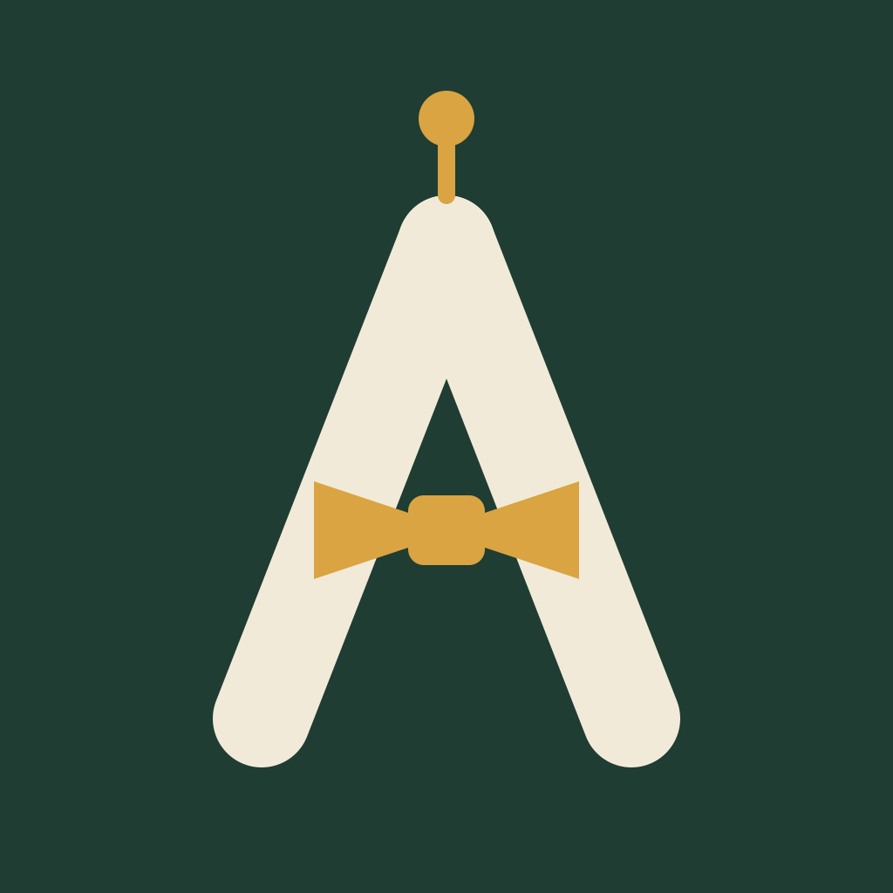
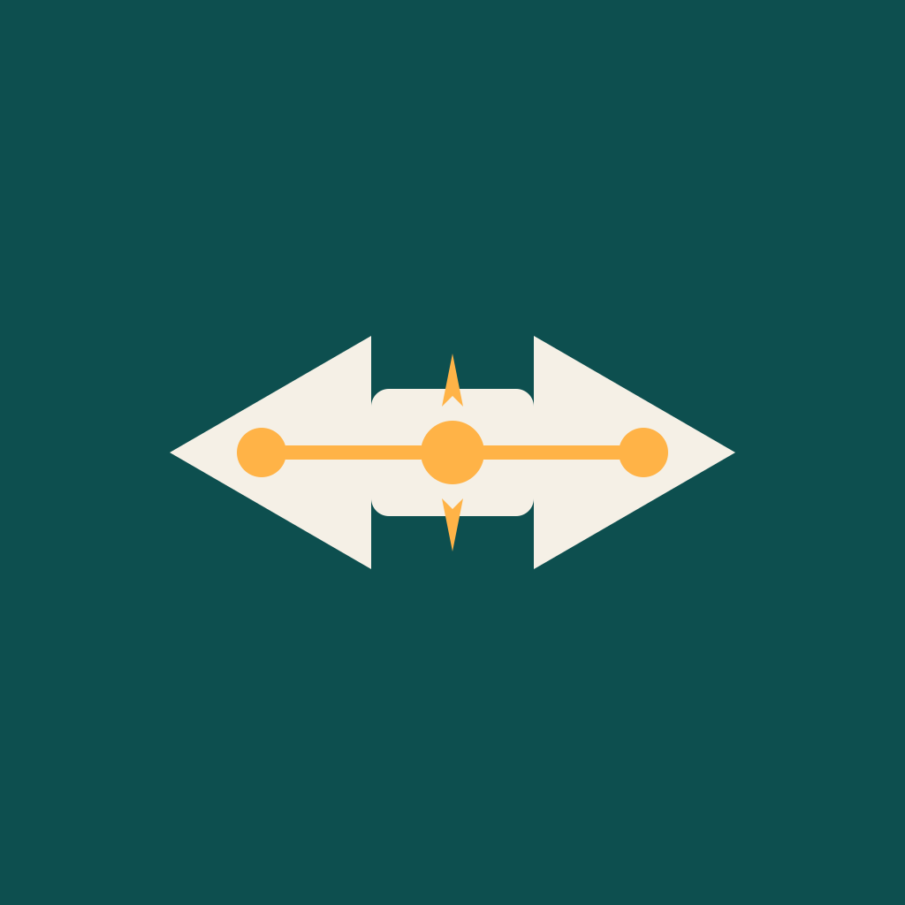
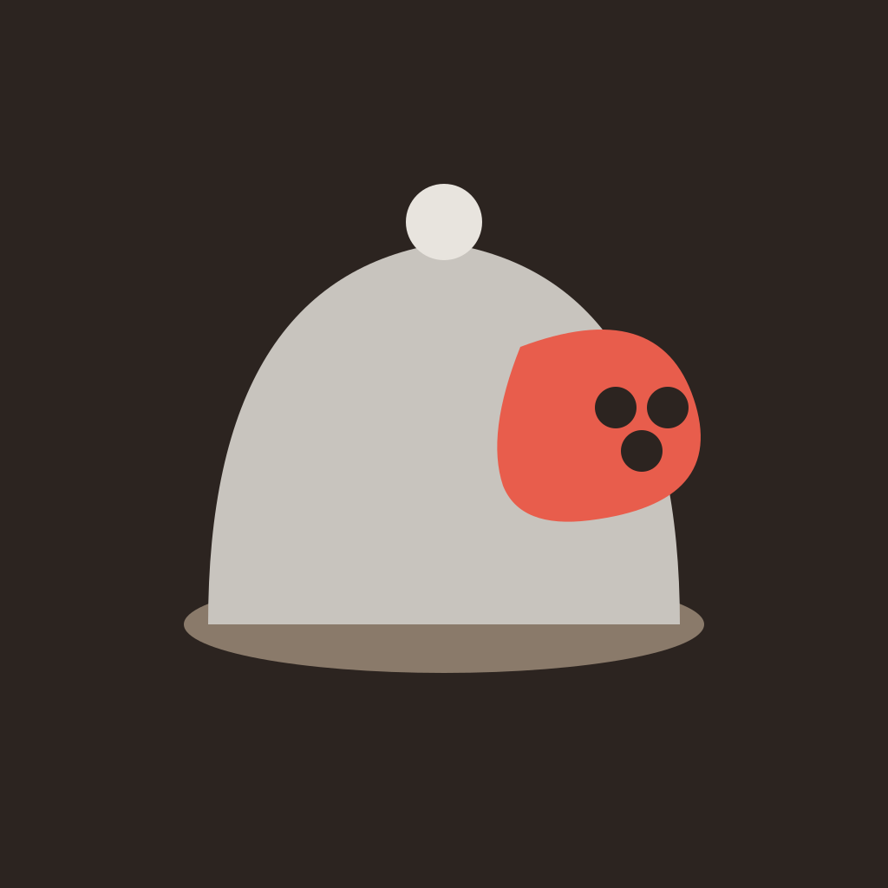
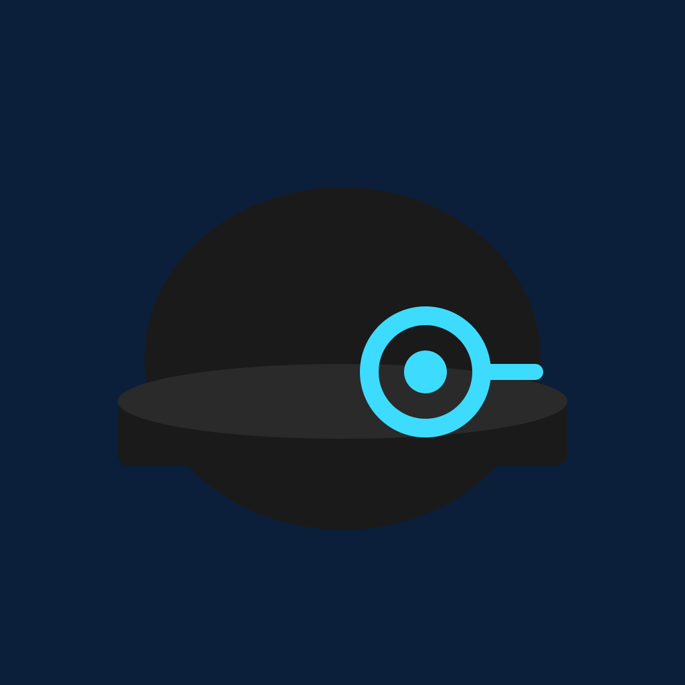

# Alfred — Slack app icon options

Nine "AI butler" icon candidates for the Alfred Slack bot, three each from
gpt-5.6-sol, grok-4.5, and fable-5 (same design brief for all three). Each
concept has editable SVG source and a 1024×1024 PNG ready to upload at
api.slack.com → the app → **Basic Information → Display Information → App icon**.

The 32px column approximates how the icon reads at sidebar size.

| Icon | 32px | Concept | Designer |
| --- | --- | --- | --- |
|  |  | `sol-bowtie-chat` — smiling chat-bubble face wearing a bow tie | gpt-5.6-sol |
|  |  | `fable-quiet-butler` — bowler hat + bow tie "invisible butler", antenna on the crown | fable-5 |
|  |  | `fable-monocle-ping` — monocled butler face knocked out of a chat bubble, chain as circuit nodes | fable-5 |
|  |  | `fable-bow-tie-monogram` — stylized "A" wearing a bow tie, antenna at the apex | fable-5 |
|  |  | `sol-monocle-circuit` — hatted face with a circuit-trace monocle | gpt-5.6-sol |
|  |  | `grok-circuit-bowtie` — abstract bow tie as a circuit with node dots | grok-4.5 |
|  |  | `sol-cloche-signal` — gloved hand serving a cloche with antenna handle | gpt-5.6-sol |
|  |  | `grok-cloche-bubble` — serving cloche with a chat-bubble accent | grok-4.5 |
|  |  | `grok-bowler-monocle` — dark bowler hat with a cyan monocle eye | grok-4.5 |

To regenerate a PNG from its SVG source:

```sh
rsvg-convert -w 1024 -h 1024 assets/alfred-icons/<name>.svg -o assets/alfred-icons/<name>.png
```
